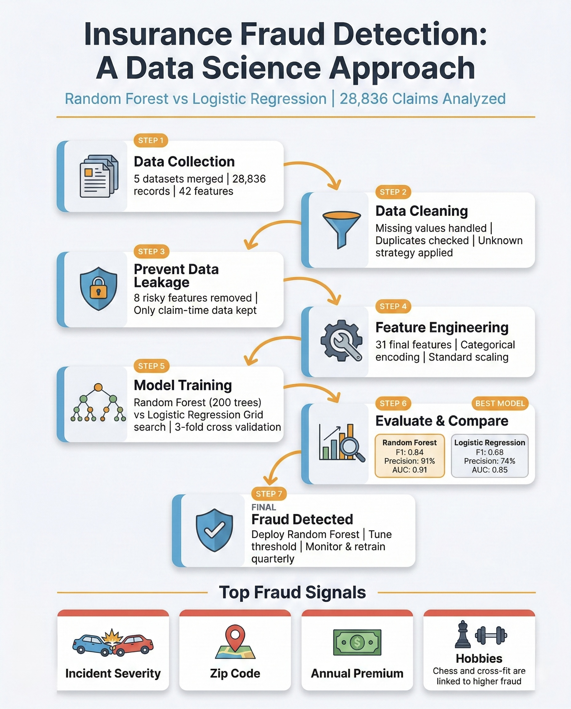

# 🛡️ Insurance Fraud Detection: A Data Science Approach

A data science project for detecting fraudulent insurance claims by developing and comparing two machine learning models (**Random Forest** and **Logistic Regression**) across a real-world, multi-source insurance dataset of 28,836 claims.

[](https://www.python.org/downloads/)
[](https://scikit-learn.org/)
[](https://pandas.pydata.org/)
[](https://opensource.org/licenses/MIT)



---

## 📋 Table of Contents

- [🎯 Overview](#-overview)
- [✨ Features](#-features)
- [📦 Dataset](#-dataset)
- [🚀 Installation](#-installation)
- [💻 Usage](#-usage)
- [📁 Project Structure](#-project-structure)
- [🔄 Pipeline & Approach](#-pipeline--approach)
- [📊 Results](#-results)
- [👨‍💻 Author](#-author)
- [🙏 Acknowledgments](#-acknowledgments)
- [🔮 Future Improvements](#-future-improvements)
- [📚 References](#-references)

---

## 🎯 Overview

Insurance fraud costs the industry billions annually. This project builds an end-to-end fraud detection pipeline that merges five source tables, applies careful preprocessing to prevent data leakage, tunes two classifiers with grid search, and evaluates them with nested cross-validation and a comprehensive suite of metrics.

**Key highlights:**

- **Best model:** Random Forest: F1 = **0.843**, ROC-AUC = **0.905**, Precision = **0.911**
- **Dataset size:** 28,836 claims with a **27% fraud rate**
- **Data leakage prevention:** post-investigation features (claim amounts) deliberately excluded
- **Missing value strategy:** `?` values preserved as `"unknown"` rather than imputed, retaining information
- **Reproducible pipeline:** sklearn `Pipeline` + `ColumnTransformer` ensures no leakage between train and test

---

## ✨ Features

- 🔗 **Multi-source Data Integration**
  - Five CSV files merged on `CustomerID` (demographics, policy, vehicle, claim, labels)
  - EAV-format vehicle table pivoted to one row per customer

- 🧹 **Robust Preprocessing**
  - Leakage-safe feature selection (only claim-filing-time features used)
  - `"unknown"` fill strategy for categorical missings (preserves information)
  - Duplicate detection and removal
  - Correlation analysis and variance filtering

- 🤖 **Two-Model Comparison**
  - **Random Forest**: 96-combination grid search (3-fold CV)
  - **Logistic Regression**: 48-combination grid search with multiple solvers and penalties

- 📈 **Rigorous Evaluation**
  - Nested cross-validation for unbiased model comparison
  - ROC curve + AUC, Precision-Recall curve + AUC
  - Confusion matrix, overfitting analysis (train vs. test gap)
  - Full classification report (Accuracy, Precision, Recall, F1, Balanced Accuracy)

- 💡 **Interpretability**
  - Random Forest feature importance ranking
  - Logistic Regression coefficient analysis

---

## 📦 Dataset

> **Note:** The raw data files are **not included** in this repository. The snapshots below illustrate the structure and content of each source table.

The dataset consists of five CSV files that are merged during preprocessing:

| File | Rows | Columns | Description |
|---|---|---|---|
| `Traindata_with_Target.csv` | 28,836 | 2 | Customer IDs and fraud labels (`Y` / `N`) |
| `Train_Demographics.csv` | 28,836 | 10 | Insured person attributes |
| `Train_Policy.csv` | 28,836 | 10 | Insurance policy details |
| `Train_Vehicle.csv` | 115,344 | 3 | Vehicle info in long (EAV) format (~4 rows per customer) |
| `Train_Claim.csv` | 28,836 | 19 | Incident details and claim amounts |

**Dataset Statistics:**
- Total records: 28,836
- Fraud cases: 7,785 (27.0%)
- Non-fraud cases: 21,051 (73.0%)
- Final features used: 32 (after leakage exclusion)
- Train / Test split: 80% / 20% (stratified)

**Features excluded to prevent data leakage** *(determined only after investigation)*:

| Excluded Feature | Reason |
|---|---|
| `AmountOfTotalClaim` | Known only after claim settlement |
| `AmountOfInjuryClaim` | Known only after claim settlement |
| `AmountOfPropertyClaim` | Known only after claim settlement |
| `AmountOfVehicleDamage` | Known only after claim settlement |
| `DateOfIncident` | Retrospective metadata |
| `IncidentAddress` | High-cardinality identifier, not generalizable |
| `InsurancePolicyNumber` | Unique identifier, not a predictive feature |

---

## 🚀 Installation

### Prerequisites

- Python 3.8 or higher
- pip package manager
- 4 GB+ RAM recommended (GridSearchCV with 288 fits)

### Setup

1. **Clone the repository**
```bash
git clone https://github.com/SalemAlnaqbi/Insurance-Fraud-Detection.git
cd Insurance-Fraud-Detection-A-Data-Science-Approach
```

2. **Create a virtual environment** (recommended)
```bash
python -m venv venv
source venv/bin/activate  # On Windows: venv\Scripts\activate
```

3. **Install dependencies**
```bash
pip install pandas numpy matplotlib scikit-learn jupyter
```

4. **Add the dataset**
   - Place the five CSV files inside a `TrainData/` folder:
   ```
   TrainData/
   ├── Traindata_with_Target.csv
   ├── Train_Demographics.csv
   ├── Train_Policy.csv
   ├── Train_Vehicle.csv
   └── Train_Claim.csv
   ```

---

## 💻 Usage

### Run the notebook

```bash
jupyter notebook insurance_fraud_detection.ipynb
```

The notebook is self-contained and runs top-to-bottom. Each major section is clearly marked:

| Section | What it does |
|---|---|
| **Dataset Overview** | Snapshot of each source table's structure |
| **1 · Project Overview** | Aims and objectives |
| **2 · Case Study Analysis** | Business context and challenge framing |
| **3 · Pre-processing** | Merging, cleaning, feature selection, splitting |
| **4 · Random Forest** | Model build, hyperparameter tuning, feature importance |
| **5 · Logistic Regression** | Model build, hyperparameter tuning, coefficient analysis |
| **6 · Model Comparison** | Nested CV, ROC/PR curves, confusion matrices, overfitting check |
| **7 · Final Recommendation** | Best model justification |
| **8 · Conclusion** | Achievements, reflections, future work |

> **Expected runtime:** ~30–60 minutes for the full grid searches (288 + 144 CV fits). Reduce `n_estimators` in `rf_param_grid` for faster experimentation.

---

## 📁 Project Structure

```
Insurance-Fraud-Detection/
├── TrainData/                          # Raw data files (not included in repo)
│   ├── Traindata_with_Target.csv
│   ├── Train_Demographics.csv
│   ├── Train_Policy.csv
│   ├── Train_Vehicle.csv
│   └── Train_Claim.csv
├── insurance_fraud_detection.ipynb     # Main notebook (full pipeline)
└── README.md                           # This file
```

---

## 🔄 Pipeline & Approach

### End-to-End Workflow

```
5 Raw CSV Files
      │
      ▼
  Data Merging  ──────────────────────────────────────────────────────┐
  (join on CustomerID, pivot EAV vehicle table)                       │
      │                                                               │
      ▼                                                           28,836 rows
  Feature Selection                                                  42 cols
  (exclude post-investigation fields)
      │
      ▼
  Missing Value Handling
  (categorical → "unknown",  numerical → median)
      │
      ▼
  Type Conversion + Correlation / Variance Filtering
      │
      ▼
  Stratified Train / Test Split  (80% / 20%)
      │
      ├─────────────────────────────────────────┐
      ▼                                         ▼
  Random Forest Pipeline               Logistic Regression Pipeline
  ┌──────────────────────┐            ┌──────────────────────┐
  │ ColumnTransformer    │            │ ColumnTransformer    │
  │  StandardScaler      │            │  StandardScaler      │
  │  OneHotEncoder       │            │  OneHotEncoder       │
  ├──────────────────────┤            ├──────────────────────┤
  │ GridSearchCV (3-fold)│            │ GridSearchCV (3-fold)│
  │ 96 combinations      │            │ 48 combinations      │
  └──────────────────────┘            └──────────────────────┘
      │                                         │
      └──────────────┬──────────────────────────┘
                     ▼
          Nested Cross-Validation
          (outer 3-fold, inner 3-fold)
                     │
                     ▼
          Test Set Evaluation
          ROC-AUC · PR-AUC · F1 · Confusion Matrix
```

### Preprocessing Details

| Step | Strategy | Rationale |
|---|---|---|
| Categorical missings | Fill with `"unknown"` | Preserves the fact that information was missing |
| Numerical missings | Fill with median | Robust to outliers common in claim data |
| `?` placeholder values | Treated as `NaN` then filled | Source data uses `?` for unknown fields |
| Categorical encoding | `OneHotEncoder(drop='first')` | Avoids dummy variable trap |
| Numerical scaling | `StandardScaler` | Required for Logistic Regression convergence |

### Hyperparameter Search Space

**Random Forest** (96 combinations, 3-fold CV = 288 fits)

| Parameter | Values searched |
|---|---|
| `n_estimators` | 100, 200 |
| `max_depth` | 10, 20, None |
| `min_samples_split` | 2, 5 |
| `min_samples_leaf` | 1, 2 |
| `max_features` | `sqrt`, `log2` |
| `class_weight` | `balanced`, None |

**Logistic Regression** (48 combinations, 3-fold CV = 144 fits)

| Parameter | Values searched |
|---|---|
| `C` | 0.1, 1.0, 10.0 |
| `penalty` | `l1`, `l2` |
| `solver` | `liblinear`, `saga` |
| `max_iter` | 1000, 2000 |
| `class_weight` | `balanced`, None |

---

## 📊 Results

### Test Set Performance Comparison

| Metric | 🌲 Random Forest | 📉 Logistic Regression |
|---|---|---|
| **Accuracy** | **0.9213** | 0.8388 |
| **Precision** | **0.9106** | 0.7380 |
| **Recall** | **0.7855** | 0.6243 |
| **F1 Score** | **0.8434** | 0.6764 |
| **Balanced Accuracy** | **0.8785** | 0.7712 |
| **ROC-AUC** | **0.905** | 0.846 |
| **PR-AUC** | **0.848** | N/A |

### Nested Cross-Validation (Unbiased Comparison)

| Model | Fold 1 F1 | Fold 2 F1 | Fold 3 F1 | Mean F1 | Std |
|---|---|---|---|---|---|
| 🌲 Random Forest | 0.8401 | 0.8485 | 0.8515 | **0.8467** | ±0.0048 |
| 📉 Logistic Regression | 0.6755 | 0.6980 | 0.6883 | 0.6873 | ±0.0092 |

### Overfitting Analysis

| Model | Train F1 | Test F1 | Gap |
|---|---|---|---|
| 🌲 Random Forest | 0.957 | 0.843 | 0.114 |
| 📉 Logistic Regression | 0.683 | 0.676 | 0.007 |

> Random Forest shows a moderate train/test gap (slight overfitting), but generalises well; the nested CV confirms consistent real-world performance. Logistic Regression has near-zero gap but substantially lower absolute performance.

### Best Hyperparameters Found

**Random Forest**
```
n_estimators    : 200
max_depth       : None
max_features    : log2
min_samples_leaf: 2
min_samples_split: 2
class_weight    : balanced
```

**Logistic Regression**
```
C           : 1.0
penalty     : l1
solver      : saga
max_iter    : 1000
class_weight: None
```

### ✅ Final Recommendation

> **Deploy Random Forest as the primary fraud detection model.**
>
> It achieves a **91% precision** (very few honest customers are incorrectly flagged) while still catching **79% of all fraudulent claims** (recall). The 17-point F1 advantage over Logistic Regression justifies the added computational cost in a domain where missed fraud has direct financial consequences.

---

## 👨‍💻 Author

**Salem Alnaqbi**

- GitHub: [@SalemAlnaqbi](https://github.com/SalemAlnaqbi)
- LinkedIn: [salemalnaqbi](https://www.linkedin.com/in/salemalnaqbi/)

---

## 🙏 Acknowledgments

- **scikit-learn**: Pipeline, GridSearchCV, ColumnTransformer, and all classifiers
- **pandas / NumPy**: Data merging, reshaping, and feature engineering
- **matplotlib**: ROC curves, PR curves, confusion matrices, feature importance charts
- **Tan, Steinbach & Kumar (2019)** - *Introduction to Data Mining*: theoretical grounding for model selection and evaluation
- **Bishop (2006)** - *Pattern Recognition and Machine Learning*: probabilistic interpretation of Logistic Regression

---

## 🔮 Future Improvements

- [ ] Add **XGBoost / LightGBM** for gradient-boosted comparison
- [ ] Introduce **SHAP values** for per-prediction explainability (regulatory compliance)
- [ ] Engineer time-based features (policy age at claim, days since last claim)
- [ ] Use **time-aware train/test split** (train on older claims, test on newer)
- [ ] Incorporate external signals (local crime rates, weather, economic indicators)
- [ ] Build a **real-time scoring API** (FastAPI) for claim-submission integration
- [ ] Set up **model monitoring** with periodic retraining triggers on performance drift

---


